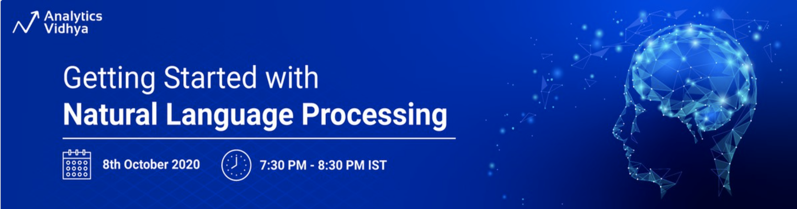
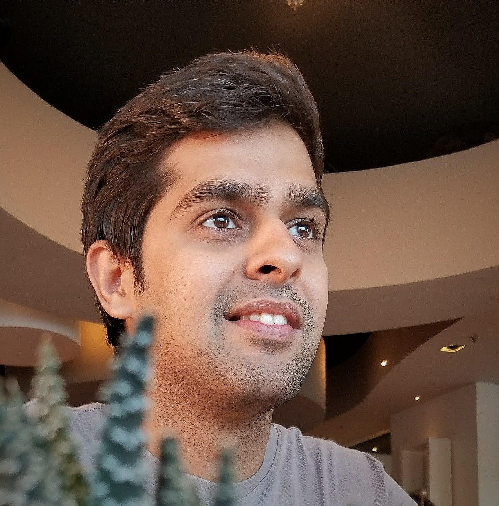

# Getting Started with NLP : Webinar
Repository for Analytics Vidhya Webinar

+ :calendar: Date: October 8th 2020
+ :alarm_clock: Time: 1930 to 2030 IST
+ :link: Registration Link [DataHack-AnalyticsVidhya](https://datahack.analyticsvidhya.com/contest/webinar-getting-started-with-natural-language-proc/)

## About the Webinar:
In the past couple of years, Natural Language Processing (NLP) or processing of textual data has seen great interest and research. Text is not just another unstructured type of data, it has a lot more to it than what meets the eye. Textual data is a representation of our thoughts, ideas, knowledge and even communication.

In this webinar, Raghav Bali will discuss the basics of natural language processing, creating word embeddings and developing models to perform various NLP tasks such as sentiment analysis, auto correction and much more.

## Key Takeaways from the Webinar:
+ Learn and understand the basics of NLP and required workflows
+ Understand how to prepare textual datasets by performing steps such as duplicate checks, spelling corrections and text wrangling
+ Understand different ways of representing textual data
+ Brief coverage of the various NLP tasks using traditional and advanced deep learning architectures

## Who is this Webinar for?
This webinar is for anyone who is interested in getting started with Natural Language Processing. A lot of ML enthusiasts are well adept at handling structured data but are unaware about the concepts related to unstructured textual data and NLP tasks. This webinar will help you build on the basics and step into the world of NLP

## Speaker

__Raghav Bali, Senior Data Scientist - Optum (United Healthgroup)__

Raghav is a senior Data Scientist and Published Author of multiple ML/DL books. Raghav's work involves research development of enterprise level solutions based on Machine Learning, Deep Learning and Natural Language Processing for Healthcare related use cases. He has also authored more than 5 books with leading publishers, the recent one on advancements in Transfer Learning research.
